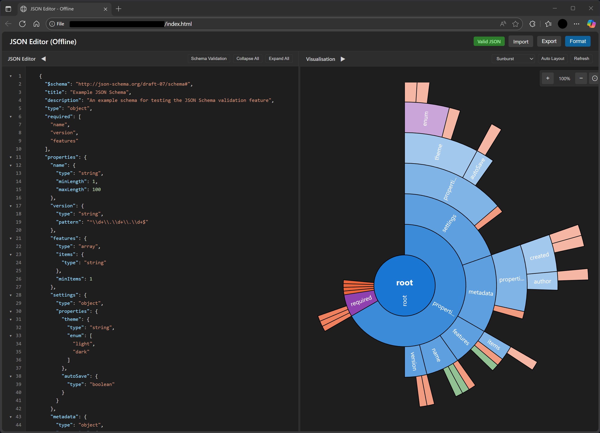

# JSON Editor

A fully offline JSON editor with multiple visualisation types and real-time validation.

## Features

### Editor
- ✅ Syntax highlighting for JSON
- ✅ Collapsible JSON nodes (fold/unfold objects and arrays)
- ✅ Real-time JSON validation with error messages
- ✅ Line numbers
- ✅ Import/Export JSON files
- ✅ Format/prettify JSON
- ✅ JSON Schema validation support
- ✅ Dark theme optimised for readability

### Visualisations
- ✅ **Graph View** - Original hierarchical tree layout with draggable nodes
- ✅ **Force-Directed Graph** - Physics-based D3.js visualisation with dynamic layout
- ✅ **Treemap** - Hierarchical space-filling visualisation showing data proportions
- ✅ **Sunburst** - Circular hierarchy diagram with depth-based colour gradients
- ✅ **Table View** - Interactive table for array-based JSON with sorting, filtering, and CSV export
- ✅ Zoom controls (+, -, reset) for all graph visualisations
- ✅ Drag-to-pan canvas for easy navigation

## Quick Start

### For Offline/Airgapped Environments

Simply open **`index.html`** in Microsoft Edge or any modern browser. No internet connection required.

## Usage Instructions

### Editing JSON
1. **Type or Paste**: Enter JSON in the left editor panel
2. **Format**: Click "Expand All" to prettify with indentation
3. **Collapse**: Click "Collapse All" to minify JSON
4. **Fold Sections**: Click ▾/▸ icons next to objects/arrays to fold/unfold them
5. **Import File**: Click "Import" and select a `.json` file
6. **Export File**: Click "Export" to download current JSON

### Visualisation
1. **Select Type**: Use the dropdown in the visualisation panel to choose:
   - **Graph View** - Traditional hierarchical tree
   - **Force-Directed** - Physics simulation (great for complex structures)
   - **Treemap** - Space-filling blocks (shows data proportions)
   - **Sunburst** - Circular diagram (perfect for deep nesting)
   - **Table View** - Spreadsheet format (requires array of objects)

2. **Interact**:
   - **Graph/Force-Directed/Treemap/Sunburst**: Drag to pan, use zoom controls (+, -, ⊙)
   - **Table View**: Click column headers to sort, use search box to filter, click "Copy as CSV" to export

3. **Refresh**: Click "Refresh" button to reset visualisation

### Schema Validation
1. Click "Schema Validation" button
2. Paste a JSON Schema in the panel
3. Validation results appear below the schema

## Example Files

- `sample-data.json` - 12 employee records (perfect for testing Table View)
- `test-table-data.json` - 5 employee records (quick Table View testing)
- `test-data.json` - Sample complex JSON for testing visualisations
- `example-schema.json` - Sample JSON Schema for validation testing

## Requirements

- Modern web browser with ES6 support (Edge, Chrome, Firefox)
- No internet connection needed
- No installation or server required
- Can be emailed and run directly from desktop

## Architecture

The application is a completely self-contained single HTML file (`index.html`) with all CSS and JavaScript embedded inline. The only external dependency is D3.js (loaded from CDN for Force-Directed Graph, Treemap, and Sunburst visualisations), which can be embedded for fully offline use. Works in completely airgapped environments.

## Browser Compatibility

Tested on Microsoft Edge on Windows 11. Should work on any modern browser supporting ES6, FileReader API, Blob API, and SVG.
